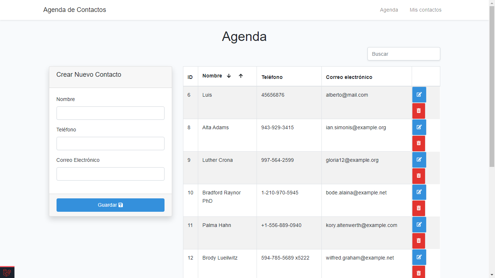
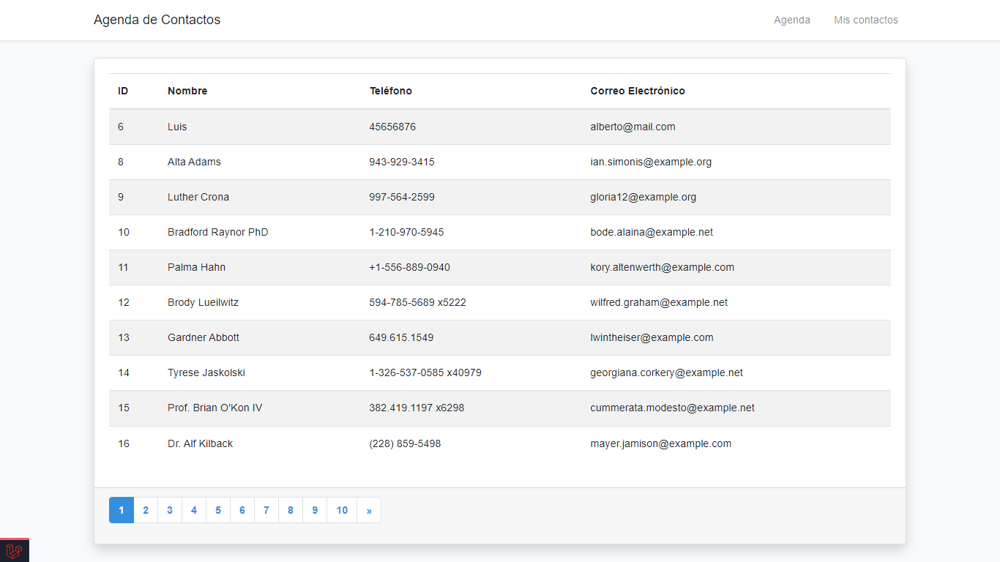

# Overview - Contact List

>This is a contact list web site. There is a form to add, editing and deleting contacts. A table shows the contact list and you may search users by name. 
This is an app **API RESTful** developed with **Laravel** and **Vue** integrating **Vue Router**, **Vuex**, **Axios** and **Vue-Pagination**.





# Requirements
* Local server XAMPP
    * PHP 7.2
    * phpMyAdmin

* Lastest version
    * Composer
    * Node.js
    * npm

# Get start

### **Download or clone this repository**
```bash
git clone https://github.com/olmos-dev/contact-list.git
```

### **Install**
You may install vendor folder
```bash
composer update
```

You may install node modules
```bash
npm install
```

### **Config database**
1. Create a new database for this project

2. Create  a new **.env** file

3. Now setup params and your database connection in **.env** file 

4. You may migrate database tables
    ```bash
    php artisan migrate
    ```
5. You may run seeders
    ```bash
    php artisan db:seed
    ```
Note: 
if you use another DBMS you shoud look the official documentation for laravel and setup your params to *.env* file with new changes. [Read more](https://laravel.com/docs/7.x/database "go documentation")

### **Key generate**
you should assign a new key generate for this app
```bash
php artisan key:generate
```

# Run project
run laravel server
```bash
php artisan serve
```

run npm server
```bash
npm run watch
```
Now open your browser and enjoy this web aplicaction!

# Build with
* Laravel 7
* Vue 3
* Bootstrap 4.6
* PHP 7.2
* MySQL 
* Javascript

# Author

Alberto Olmos 

# License

The Laravel framework is open-sourced software licensed under the [MIT license](https://opensource.org/licenses/MIT).
